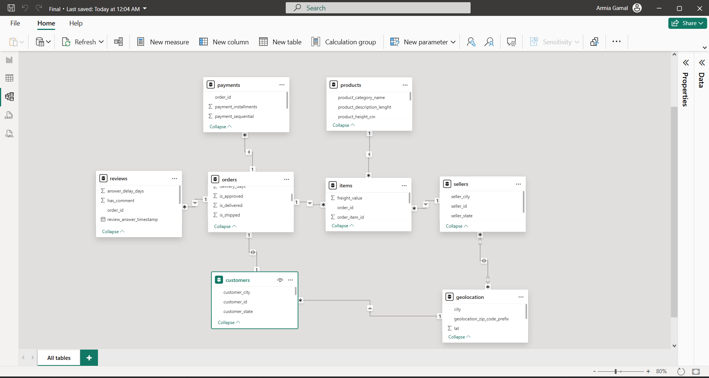
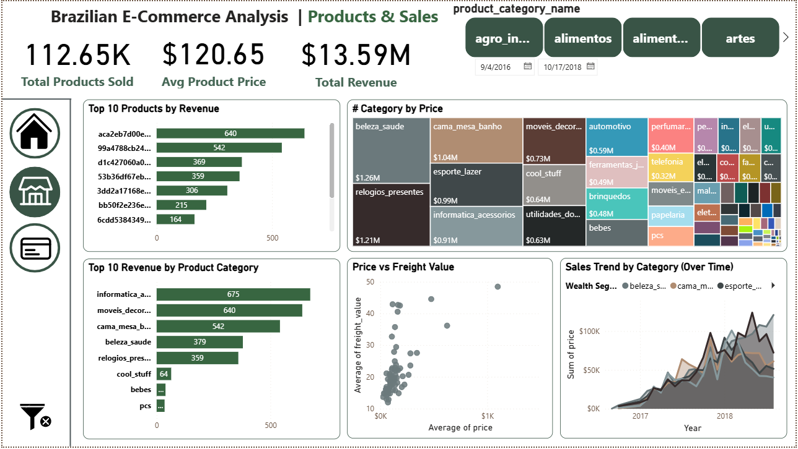
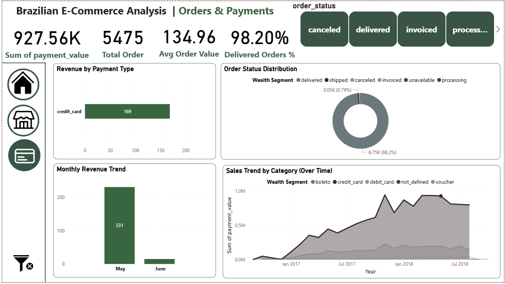

# Brazilian E-Commerce Analysis

## Overview

This project provides a comprehensive analysis of a Brazilian e-commerce dataset using data preprocessing, exploratory data analysis, machine learning, and interactive dashboarding.

The objective is to understand customer behavior, product performance, and operational efficiency, as well as to build a predictive model for customer satisfaction.

---

## Objectives

* Analyze sales performance and revenue distribution
* Understand customer purchasing behavior
* Evaluate order and delivery performance
* Identify key drivers of customer satisfaction
* Build a machine learning model to predict satisfaction

---

## Tools and Technologies

* Python (Pandas, NumPy, Scikit-learn)
* Power BI
* Jupyter Notebook
* CSV datasets

---

## Dataset Description

The dataset consists of multiple relational tables:

* Customers
* Orders
* Order Items
* Payments
* Products
* Sellers
* Reviews
* Geolocation

These tables are connected using keys such as `order_id`, `customer_id`, and `product_id`.

---

## Data Preprocessing

### Data Cleaning

* Converted date columns to datetime format
* Standardized categorical variables
* Handled missing values using:

  * Median for numerical features
  * Mode or logical replacements for categorical features
* Removed duplicates
* Aggregated order-level metrics

### Feature Engineering

New features were created including:

* approval_hours
* shipping_days
* delivery_days
* delay_vs_estimated
* total_price
* total_freight
* installments
* answer_delay_days
* has_comment

Outliers were detected using the IQR method and clipped to reasonable ranges.

---

## Data Model (Relationships)



The data model follows a relational structure where:

* Orders act as the central table
* Items and Payments are linked via order_id
* Customers and Geolocation provide location context
* Products and Sellers provide product-level details
* Reviews provide customer feedback

---

## Exploratory Data Analysis

The analysis includes:

* Revenue distribution across product categories
* Top-performing products and categories
* Price vs freight relationships
* Monthly and yearly sales trends
* Payment methods analysis
* Order status distribution

---

## Dashboard Description

### 1. Home Page

* Overview of the analysis
* Navigation between dashboard sections

### 2. Products & Sales

* Total products sold
* Average product price
* Total revenue
* Top products by revenue
* Revenue by product category
* Price vs freight analysis
* Sales trends over time

### 3. Orders & Payments

* Total payment value
* Number of orders
* Average order value
* Delivery success rate
* Revenue by payment type
* Monthly revenue trends
* Order status distribution

---

## Dashboard Preview

### Home Page


### Products & Sales



### Orders & Payments



---

## Machine Learning Model

A classification model was built to predict customer satisfaction.

### Target Variable

* satisfaction (1 if review_score >= 4, else 0)

### Model Used

* Random Forest Classifier

### Features Used

* approval_hours
* shipping_days
* delivery_days
* delay_vs_estimated
* total_price
* total_freight
* installments
* answer_delay_days
* has_comment

### Model Evaluation

The model was evaluated using classification metrics such as precision, recall, and F1-score.

Key finding:

Delivery delays relative to the estimated date were the strongest predictors of customer dissatisfaction, followed by delivery duration and shipping cost. 

---

## Key Insights

* A small number of product categories generate a large portion of total revenue
* Credit card is the dominant payment method
* Most orders are successfully delivered
* Delivery delays significantly impact customer satisfaction
* Freight cost has a noticeable relationship with product price

---

## Recommendations

* Improve delivery accuracy to reduce delays
* Optimize logistics to reduce shipping time and cost
* Focus on high-performing product categories
* Enhance customer experience to maintain high satisfaction levels
* Use predictive models to identify potential dissatisfied customers

---

## Project Structure

```
E-Commerce-Analysis/
│
├── dashboard/
│   └── ecommerce_dashboard.pbix
│
├── data/
│   ├── raw/
│   └── processed/
│
├── notebook/
│   └── ecommerce_analysis.ipynb
│
├── images/
│   ├── home.png
│   ├── products.png
│   ├── orders.png
│   └── relations.png
│
├── reports/
│   ├── ecommerce_report.pdf
│   └── ecommerce_presentation.pptx
│
└── README.md
```

---

## How to Run the Project

1. Open the notebook:
   notebook/ecommerce_analysis.ipynb

2. Run all cells to:

   * Clean and preprocess data
   * Perform analysis
   * Train the machine learning model

3. Open Power BI dashboard:
   dashboard/ecommerce_dashboard.pbix

4. Interact with filters and visuals

---

## Future Improvements

* Deploy the model as an API
* Integrate real-time data pipelines
* Improve feature engineering for better predictions
* Add customer segmentation models

---

## Author

- Armia Gamal

---
